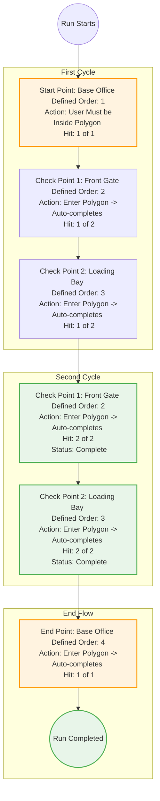

# Route Completion Flow

This diagram illustrates how the candidate's application should handle the progression through the route checkpoints defined in `0-example-route.json`, adhering to the strict sequential and non-consecutive hit rules.

### Routing Logic Overview
- **Start Point (SP):** The user *must* be inside the SP's polygon to begin the run. SP is assigned an `order` and always requires 1 `hit`.
- **Check Points (CPs):** The user must follow the `order` defined on each CP. Since a CP may require multiple `hits` but *cannot* be hit consecutively, the user must move to the next CP in the order sequence before returning to complete subsequent hits. CPs auto-complete their required hits upon entering their polygon.
- **End Point (EP):** Only becomes available after all CP hit requirements are fulfilled. EP is the final step in the `order` sequence and requires 1 `hit` to conclude the run.

### Key Behaviours to Implement:
1. **Enforce Start Condition:** The run cannot be started unless the user provides a location update inside the SP parameter. An error toast should appear if the user tries to press the start button while outside the SP parameter.
2. **Dynamic UI/Pathing:** Visualizing the path based on the sequence (e.g., SP -> CP1 -> CP2 -> CP1 -> CP2 -> EP) is crucial so the user knows exactly where to go next. Developers have creativity in solving this UX challenge.
3. **Auto-Complete & Auto-Advance:** Once a user steps into the active CP polygon, it must automatically register a hit and advance the active target to the next checkpoint in the sequence without manual intervention.
4. **End Sequence:** After all hits are collected across all CPs, the user is directed to the EP. Reaching the EP prompts the user to End the run, completing the sequence.
